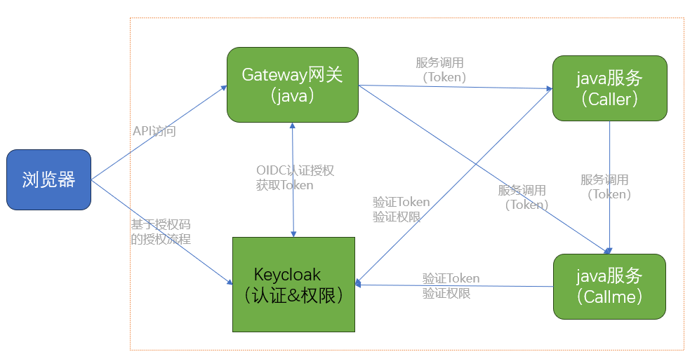
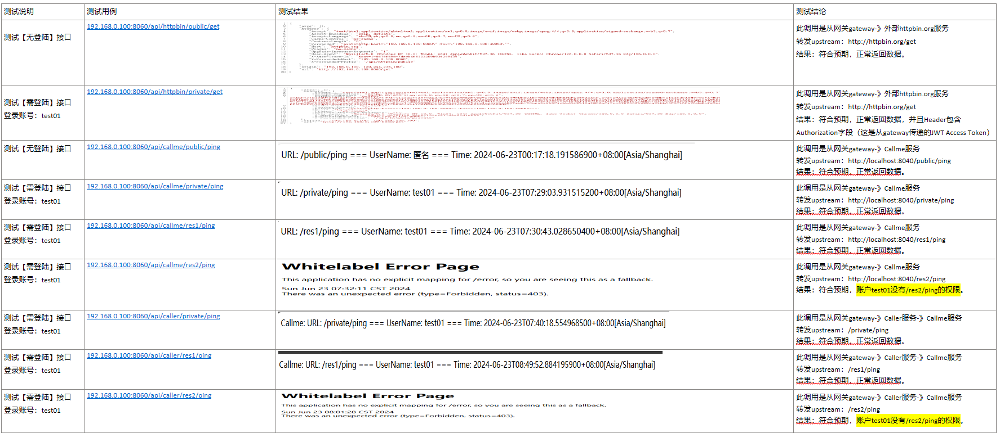

# Spring cloud gateway 集成 keycloak 系统

Keycloak 是用于现代应用程序和服务的开源身份和访问管理解决方案，与 Spring Cloud Gateway 微服务架构集成，实现业务系统的账号、身份认证、单点登录和权限的管理。
此代码库是 Demo 项目源码，演示了账号登录和权限访问控制等场景。

## ✨ 系统功能

- 实现了简单业务的 Web 服务（Callme 服务）
- 实现了 Web 服务之间的调用（Caller 服务->Callme 服务）
- 实现了 Gateway 网关服务（路由到后端服务：Caller 服务和 Callme 服务）
- 集成了 keycloak 系统，使其以上服务登录认证和权限控制。



## 💁‍♀️ 怎么使用

### 1、部署 keycloak 和配置用户和权限等数据

#### 安装 keycloak 开发系统

```shell
###  部署服务器，假设：192.168.0.100
docker run --restart always -d -p 8080:8080 -e KEYCLOAK_ADMIN=admin -e KEYCLOAK_ADMIN_PASSWORD=admin quay.io/keycloak/keycloak:25.0.0 start-dev

```

#### 配置用户和权限

| 配置项                                                       | 配置内容                                                                                                                                                                               | 说明                                                                                                                                                                                                                         |
| ------------------------------------------------------------ | -------------------------------------------------------------------------------------------------------------------------------------------------------------------------------------- | ---------------------------------------------------------------------------------------------------------------------------------------------------------------------------------------------------------------------------- |
| create realm                                                 | 名称：gwrealm                                                                                                                                                                          | 创建新 realm                                                                                                                                                                                                                 |
| create client                                                | 名称：gwclient                                                                                                                                                                         | 为 Gateway 网关创建客户端，用于授权码流程的 OIDC 客户端（与 keycloak 实现登录和认证）<br/> 基础设置：<br/> _ Client authentication 选择 ON <br/> _ Authorization 选择 OFF <br/> \_ Authentication flow 默认前 2 个选项 <br/> |
| create client                                                | 名称：service-caller-client                                                                                                                                                            | 为 Caller 服务创建客户端，用于基于角色的权限控制<br/> 基础设置：<br/> _ Client authentication 选择 ON <br/> _ Authorization 选择 ON <br/> \_ Authentication flow 只选 Service accounts roles <br/>                           |
| create client                                                | 名称：service-callme-client                                                                                                                                                            | 为 Callme 服务创建客户端，用于基于角色的权限控制 <br/> 基础设置：<br/> _ Client authentication 选择 ON <br/> _ Authorization 选择 ON <br/> \_ Authentication flow 只选 Service accounts roles <br/>                          |
| Credential 页（in "gwclient"）                               | Client Authenticator：ClientId and Secret                                                                                                                                              | 记住 Client Secret 密码，在 java 应用中需要                                                                                                                                                                                  |
| Credential 页（in "service-caller-client"）                  | Client Authenticator：ClientId and Secret                                                                                                                                              | 记住 Client Secret 密码，在 java 应用中需要                                                                                                                                                                                  |
| Credential 页（in "service-callme-client"）                  | Client Authenticator：ClientId and Secret                                                                                                                                              | 记住 Client Secret 密码，在 java 应用中需要                                                                                                                                                                                  |
| Roles 页（in "gwclient"）                                    | 2 个角色：gw-role1，gw-role2                                                                                                                                                           | 在 gwrealm 中创建角色也是可以的，demo 使用了 gwclient 创建角色                                                                                                                                                               |
| create user（in realm）                                      | 名称：test01，test02，test03                                                                                                                                                           | 创建 3 个用户，用于测试登录、基于角色的权限访问。 <br/> test01 用户”Role Mapping“ 分配角色 ”gw-role1“ <br/> test02 用户”Role Mapping“ 分配角色 ”gw-role2“                                                                    |
| Authorization 页的 Resources（in "service-caller-client"）   | 创建 2 个资源: <br/> Name/Display name：res1-resource <br/> URIs：/res1/\* <br/> Name/Display name：res2-resource <br/> URIs：/res2/\* <br/>                                           | 这里资源就是 java 服务中匹配的接口                                                                                                                                                                                           |
| Authorization 页的 policies（in "service-caller-client"）    | 创建 2 个基于角色的 policy: <br/> Name：res1-policy <br/> Roles：gw-role1 <br/> Name：res2-policy <br/> Roles：gw-role2 <br/>                                                          | 这 policy 绑定了之前在 gwclient 客户端创建的角色（创建用户的时候，已经把用户和角色建立映射关系）                                                                                                                             |
| Authorization 页的 Permissions（in "service-caller-client"） | 创建 2 个权限: <br/> Name：res1-perm <br/> Resource：res1-resource <br/> Policies ：res1-policy <br/> Name：res2-perm <br/> Resource：res2-resource <br/> Policies ：res2-policy <br/> | 这里权限就是把资源和 policy 绑定起来, 换句话说，一个接口资源能找到在哪个角色下，哪些用户能访问。                                                                                                                             |
| Authorization 页的 Resources（in "service-callme-client"）   | 创建 2 个资源: <br/> Name/Display name：res1-resource <br/> URIs：/res1/\* <br/> Name/Display name：res2-resource <br/> URIs：/res2/\* <br/>                                           | 这里资源就是 java 服务中匹配的接口                                                                                                                                                                                           |
| Authorization 页的 policies（in "service-callme-client"）    | 创建 2 个基于角色的 policy: <br/> Name：res1-policy <br/> Roles：gw-role1 <br/> Name：res2-policy <br/> Roles：gw-role2 <br/>                                                          | 这 policy 绑定了之前在 gwclient 客户端创建的角色（创建用户的时候，已经把用户和角色建立映射关系）                                                                                                                             |
| Authorization 页的 Permissions（in "service-callme-client"） | 创建 2 个权限: <br/> Name：res1-perm <br/> Resource：res1-resource <br/> Policies ：res1-policy <br/> Name：res2-perm <br/> Resource：res2-resource <br/> Policies ：res2-policy <br/> | 这里权限就是把资源和 policy 绑定起来, 换句话说，一个接口资源能找到在哪个角色下，哪些用户能访问。                                                                                                                             |

### 2、运行 java 服务（gateway、caller、callme）

#### 1）、Java 运行环境

下载：
[Java Downloads | Oracle 中国](https://www.oracle.com/cn/java/technologies/downloads/#java17)

```shell
# install
rpm -ivh jdk-17_linux-x64_bin.rpm

```

#### 2）、修改配置（keycloak 的配置数据）

```yaml
# gateway\src\main\resources\application.yml
security:
  oauth2:
    client:
      provider:
        keycloak:
          issuer-uri: http://192.168.0.100:8080/realms/gwrealm # 修改为keycloak IP和Port，域名称：gwrealm
      registration:
        keycloak:
          client-id: gwclient # 客户端名称
          client-secret: <TODO> # 客户端密钥
          authorization-grant-type: authorization_code
          scope: openid, profile, email
          redirect-uri: "/login/oauth2/code/{registrationId}?"
```

```yaml
# caller\src\main\resources\application.yml
spring:
  application:
    name: caller
  security:
    oauth2:
      resourceserver:
        jwt:
          jwk-set-uri: http://192.168.0.100:8080/realms/gwrealm/protocol/openid-connect/certs # 修改为keycloak IP和Port，域名称：gwrealm
```

```json
// caller\src\main\resources\keycloak.json
{
  "realm": "gwrealm", // 域名称：gwrealm
  "auth-server-url": "http://192.168.0.100:8080/", // 修改为keycloak IP和Port
  "resource": "service-caller-client",  // 客户端名称
  "credentials": {
    "secret": "<TODO>" // 客户端密钥
}
```

```yaml
# callme\src\main\resources\application.yml
spring:
  application:
    name: caller
  security:
    oauth2:
      resourceserver:
        jwt:
          jwk-set-uri: http://192.168.0.100:8080/realms/gwrealm/protocol/openid-connect/certs # 修改为keycloak IP和Port，域名称：gwrealm
```

```json
// callme\src\main\resources\keycloak.json
{
  "realm": "gwrealm", // 域名称：gwrealm
  "auth-server-url": "http://192.168.0.100:8080/", // 修改为keycloak IP和Port
  "resource": "service-callme-client",  // 客户端名称
  "credentials": {
    "secret": "<TODO>" // 客户端密钥
}
```

#### 3）、编译和运行 java 服务

下载源码：https://github.com/daliao/gatewayonkeycloak/releases/tag/v1.0

```shell
mvn clean package

# copy jar文件到指定目录下 (运行java程序需要安装java 17环境)
nohup java -jar caller-1.0.0-SNAPSHOT.jar &   # 默认启动端口：8020
nohup java -jar callme-1.0.0-SNAPSHOT.jar &   # 默认启动端口：8040
nohup java -jar gateway-1.0.0-SNAPSHOT.jar &  # 默认启动端口：8060

```

## 测试结果



## 📝 参考链接

[使用 Keycloak 为 Spring Cloud Gateway 和 Spring Boot 微服务启用 OAuth2 - spring 中文网 (springdoc.cn)](https://springdoc.cn/microservices-with-spring-cloud-gateway-oauth2-and-keycloak/) <br/>
[启用 Spring Cloud Gateway 的 OAuth2 支持，并将其与 Keycloak 集成 - spring 中文网 (springdoc.cn)](https://springdoc.cn/spring-cloud-gateway-oauth2-with-keycloak/) <br/>
[Using Keycloak for Authentication and Authorization in Spring Boot App - Policy Enforcer Config - Stack Overflow](https://stackoverflow.com/questions/78297797/using-keycloak-for-authentication-and-authorization-in-spring-boot-app-policy) <br/>
[spring-projects/spring-security-samples at 6.3.x (github.com)](https://github.com/spring-projects/spring-security-samples/tree/6.3.x) <br/>
[Kong Integration with Keycloak. Via Custom Plugin in Lua (Introspect) | by Kritika Tripathi | Dev Genius](https://blog.devgenius.io/kong-integration-with-keycloak-7719d1457bd7) <br/>
[apisix/docs/en/latest/plugins/authz-keycloak.md at master · apache/apisix (github.com)](https://github.com/apache/apisix/blob/master/docs/en/latest/plugins/authz-keycloak.md) <br/>
[JSON Web Token Introduction - jwt.io](https://jwt.io/introduction) <br/>
[Final: OpenID Connect Core 1.0 incorporating errata set 2](https://openid.net/specs/openid-connect-core-1_0.html#IDToken) <br/>
